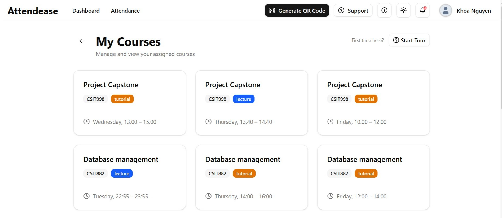

# AttendEase

QR-based attendance tracking web application built with Node.js and MySQL.



## System Requirements

Before running the project, make sure you have the following installed:

- [Node.js](https://nodejs.org/) (latest LTS version recommended)
- [MySQL Server](https://www.mysql.com/)  
  *You can use [XAMPP](https://www.apachefriends.org/) or any MySQL management tool.*

---

## ⚙️ Local Development Setup

Follow the steps below to set up and run the project on your local machine.

### 1. Install Dependencies

Open your terminal in the project directory and run:

```bash
npm install
```
### 2. Configure the Database

1. **Start your MySQL server**  
   - You can use [XAMPP](https://www.apachefriends.org/) or any MySQL server tool.  
   - Make sure the server is running before continuing.

2. **Create a new database**  
   - Example: `qr_attendance_app`  
   - You can do this via phpMyAdmin (if using XAMPP) or the MySQL command line.

3. **Set up your environment variables**  
   Create a file named `.env.local` in the root directory (if it doesn’t exist) and update the following values:

   ```env
   DB_HOST=localhost
   DB_USER=root
   DB_PASS=
   DB_NAME=qr_attendance_app

### 3. Load Database Schema and Dummy Data

Once your database is created and `.env.local` is configured, you need to load the schema and some sample (dummy) data.

1. Go to the `src/lib/server/db_schema` folder in your project.  
   Inside, you’ll find two SQL files:
   - `db_create.sql` : defines the database structure and tables.  
   - `db_dummy_load.sql`: loads sample data for testing.

2. You can load these SQL files into your database in two ways:

   **Using phpMyAdmin (Recommended if using XAMPP):**
   - Open phpMyAdmin: [http://localhost/phpmyadmin](http://localhost/phpmyadmin)
   - Select your database (`qr_attendance_app`)
   - Go to the **Import** tab
   - Click **Choose File** → select `db_create.sql`, then click **Go**
   - Repeat the same steps for `db_dummy_load.sql`

   **Using MySQL Command Line:**
   ```bash
   mysql -u root -p qr_attendance_app < db_schema/db_create.sql
   mysql -u root -p qr_attendance_app < db_schema/db_dummy_load.sql
    ```
### 4. Run the Development Server

Once your dependencies are installed and the database is configured, you can start the application in development mode.

Run the following command in your terminal:

```bash
npm run dev